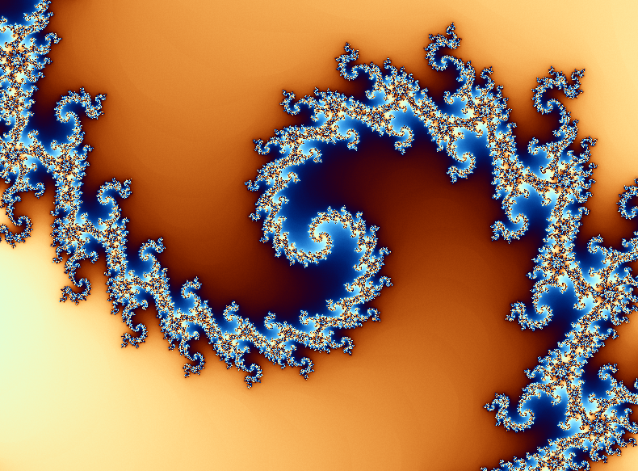

# **Mandelbrot Set Visualization - PyOpenGL**

This project is a revisit of my very first GitHub project: a Python visualization of the Mandelbrot set using numpy that I made in my freshman year of high school. In this updated version, I've sped things up by using PyOpenGL on a GPU to be able to make it not take 5 minutes to render the set. I've also mapped the colors to a cosine function so the colors are more awesome.

Check out the original project here: https://github.com/OX-S/Python-Mandelbrot

### Goals and To-Do List
* Add color customization
* Made shadow lighting more spectacular by implementing Blinn-Phong reflection mapping

  
### Sample Image

